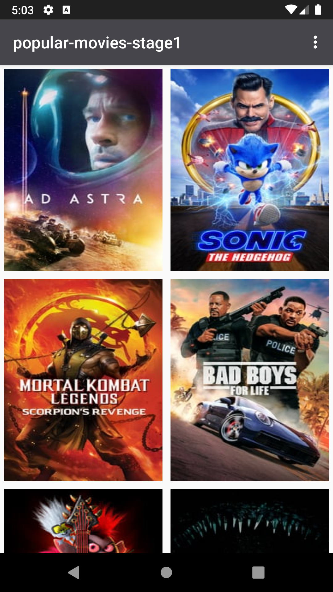
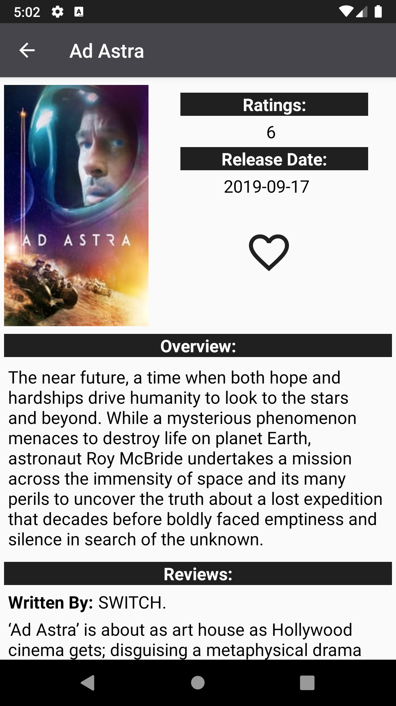

# Popular-Movies-Stage1
Udacity | Android Developer Nanodegree | Project 2: Sandwich Club

### Project Overview:
Most of us can relate to kicking back on the couch and enjoying a movie with friends and family.
In this project, you’ll build an app to allow users to discover the most popular movies playing.
This project is split into two parts, this is part 1.

In this stage you’ll build the core experience of your movies app.

Your app will:
- Present the user with a grid arrangement of movie posters upon launch.
- Allow your user to change sort order via a setting:
  * The sort order can be by most popular or by highest-rated
- Allow the user to tap on a movie poster and transition to a details screen with additional information such as:
  * original title
  * movie poster image thumbnail
  * A plot synopsis (called overview in the api)
  * user rating (called vote_average in the api)
  * release date
  
### Project Importance:
To become an Android developer, you must know how to bring particular mobile experiences to life.
Specifically, you need to know how to build clean and compelling user interfaces (UIs), fetch data
from network services, and optimize the experience for various mobile devices. You will hone these
fundamental skills in this project.

### What Will I Learn After Stage 1?
You will fetch data from the Internet with theMovieDB API.
You will use adapters and custom list layouts to populate list views.
You will incorporate libraries to simplify the amount of code you need to write

### Snapshots:
  
